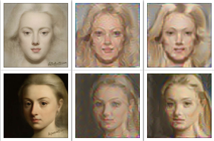
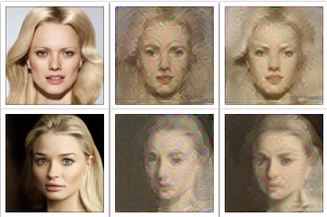

# 0091-MSc-ML-Project
Image-to-Image Translation

The image-to-image translation is an important problem in machine vision, where the main goal is to learn the relation between images from different domains. Our objective is to and a mapping between photos and art paintings of human faces. In this thesis, we explore both supervised and unsupervised learning methods to this problem. We will introduce an approach named Latent Features Transfer which could transfer the content and style information separately and recombine them to generate new images. Besides, we propose some improvements in CycleGAN model to achieve more stable training and to generate higher quality images.

Painting to Photo

Photo to Painting

